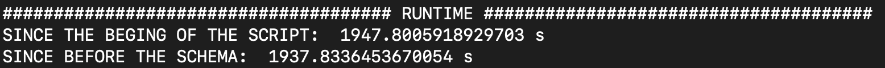
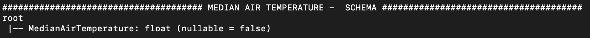

# ITMD 521 Final Project

This will be the description and deliverable for the final project for ITMD 521

## General Notes

* All commits and code must be placed in the private repo assigned at the beginning of the semester
  * Under the folder: `itmd-521` > `final`
  * Include a **Readme.md** file in the `final` directory with instructions and commands to run each of your scripts
  * Create a sub-folder: `part-one`, `part-two`, `part-three`
  * In each sub-folder provide the PySpark `.py` files to accomplish the requirements
  * I will run this to check your work and compare output
* Clone/pull you code to the spark edge server account you were given access to
* Clone via SSH key - as demonstrated in the video prepared 04/19

* Make use of any of the sample code provided to you in Blackboard
* Make extensive use of the [PySpark API documentation](https://spark.apache.org/docs/latest/api/python/index.html "PySpark API documentation") 
* Make extensive use of the Textbook -- don't go to the internet
* Make extensive use of the Disucssion Board for clarifications and questions

### Part One

This part contains two sub-sections

#### First Section

The first part of the assignment you will be data engineering. You will be converting raw text records, parsing them and saving them in many different formats in our Minio Object storage system.

* Use the raw data set you were assigned
* Use these initial parametersfor each job:
  * ``` --driver-memory 6G --executor-memory 6G --executor-cores 2 --num-executors 12 --total-executor-cores 24```

* Create a PySpark application that will read the `30.txt` from the `itmd521` bucket into a DataFrame
  * Name the PySpark application `XYZ-minio-read-and-process-AA.py`
  * Where XYZ is your initials
  * and AA is the decade you are working on
* In the same PySpark application parse the raw datasource assigned into the assigned 5 outputs and name the results the same prefix as the source (20.txt becomes 20-csv, or 20-csv-lz4, or 20-single-part-csv for example).
  * csv
  * json
  * csv with lz4 compression
  * parquet
  * csv with a single partition (need to adjust filename to not overwrite the first csv requirement)

#### Second Section

You will continue your data engineering experience in needing to read Raw text file and convert them into CSV and Parquet files. Based on your lastname starting with A-K you will need to convert the decades 30, 40, 70, and 90. Lastname L-Z will do 40, 60, and 80. These files get quite large and may take up to 15 to 48 hours to complete -- don't wait. 

* Create multiple appropriate PySpark files to do the reading
  * Name the PySpark applications in this manner: `minio-read-50.py`
  * Change the last decade number to match
  * Make sure to adjust the `SparkSession.builder.appName()` to be proper
* Save them as CSV and Parquet files in your own assign Minio S3 bucket.
  * Use the same convention as the previous questuion
  * 20-csv
  * 20-parquet

As a hint - do a test run on a small dataset - say 20.txt to see if your logic and bucket permissions are working before starting the larger jobs.

##### PART-ONE: Explanation

* First, a Spark application is built establishing a conection with the server and set all the dependencies and credentials needed
* Then, the raw data is read using the `df = spark.read.csv('s3a://itmd521/`DECADE`.txt')` command, from the minio bucked provided by the professor
* Then, Data is split taken its content as all data is saved in a large string where each position or set of positions corresponds with one column
* After that, the schema and the first 5 rows are shown
  * DECADE 30
    * Schema

      

    * First 5 rows

      

  * DECADE 40
    * Schema

      

    * First 5 rows

      

  * DECADE 70
    * Schema

      

    * First 5 rows

      

  * DECADE 90
    * Schema

      

    * First 5 rows

      

* Finally, data is saved in my repository (`vblancoravena`) into the requested formats: 
  * Decade 30: Parquet, JSON, CSV, CSV compressed in LZ4 and CSV into a single partition
  * Decades 40, 70, 90: parquet and csv
To do that, the following code are used:
* Parquet: `splitDF.write.mode("overwrite").parquet("s3a://vblancoravena/`DECADE`-parquet")`
* JSON: `splitDF.write.mode("overwrite").json("s3a://vblancoravena/`DECADE`-json")`
* CSV: `splitDF.write.mode("overwrite").csv("s3a://vblancoravena/`DECADE`-csv")`
* CSV compressed in LZ4: `splitDF.write.mode("overwrite").option("compression", "lz4").csv("s3a://vblancoravena/`DECADE`-lz4")`
* CSV into a single partition: `splitDF.repartition(1).write.mode("overwrite").csv("s3a://vblancoravena/`DECADE`-single-part-csv")`


### Part Two

This part you will read the datasets you created back into your PySpark application and create schemas where necessary.

* Create a single PySpark application
  * Name: `XYZ-minio-read.py` 
* Read your partitioned csv into a DataFrame named: `csvdf`
  * Create a schema based on the sample given in blackboard
* Show the first 10 records and print the schema
* Read your partitioned csv into a DataFrame named: `jsondf`
  * Create a schema based on the sample given in Blackboard
* Show the first 10 records and print the schema
* Read your partitioned csv into a DataFrame named: `parquetdf`
  * Show the first 10 records and print the schema
* Connect to the MariaDB server using the below details in your PySpark application
  * Connect to the database `ncdc` and table `thirties` to read out the dataframe 
  * Show the first 10 records and print the schema
  * Username and Password will be provided to you

```python
# Writing out to MySQL your DataFrame results
# https://spark.apache.org/docs/latest/api/python/reference/api/pyspark.sql.DataFrameWriter.save.html
(splitDF.write.format("jdbc").option("url","jdbc:mysql://database-240-vm0.service.consul:3306/ncdc").option("driver","com.mysql.cj.jdbc.Driver").option("dbtable","thirty").option("user",os.getenv('MYSQLUSER')).option("truncate",True).mode("overwrite").option("password", os.getenv('MYSQLPASS')).save())
```

##### PART-TWO: Explanation

* Same as part one, a Spark application is built with all of the previous requirements
* Then, a schema is created to read the file into a programmatically. The schema is the following:

      `schema = StructType([`
        `StructField("WeatherStation", IntegerType(), False),`
        `StructField("WBAN", IntegerType(), False),`
        `StructField("ObservationDate", DateType(), False),`
        `StructField("ObservationHour", IntegerType(), False),`
        `StructField("Latitude", FloatType(), False),`
        `StructField("Longitude", FloatType(), False),`
        `StructField("Elevation", IntegerType(), False),`
        `StructField("WindDirection", IntegerType(), False),`
        `StructField("WDQualityCode", IntegerType(), False),`
        `StructField("SkyCeilingHeight", IntegerType(), False),`
        `StructField("SCQualityCode", IntegerType(), False),`
        `StructField("VisibilityDistance", IntegerType(), False),`
        `StructField("VDQualityCode", IntegerType(), False),`
        `StructField("AirTemperature", DoubleType(), False),`
        `StructField("ATQualityCode", IntegerType(), False),`
        `StructField("DewPoint", DoubleType(), False),`
        `StructField("DPQualityCode", IntegerType(), False),`
        `StructField("AtmosphericPressure", DoubleType(), False),`
        `StructField("APQualityCode", IntegerType(), False)]`
        `)`

* Then the files created in part one are read and the schema and the first 10 rows are shown 

  * DECADE 30
    * Parquet
      * Schema

        

      * First 10 rows

        

    * JSON
      * Schema

        

      * First 10 rows

        

    * CSV
      * Schema

        

      * First 10 rows

        

  * DECADE 40
    * CSV
      * Schema

        

      * First 10 rows

        

  * DECADE 70
    * CSV
      * Schema

        

      * First 10 rows

        

  * DECADE 90
    * CSV
      * Schema

        

      * First 10 rows

        

* The dataframe is save it into a MySQL database located in `jdbc:mysql://database-240-vm0.service.consul:3306/ncdc` to enable the conection between the database and the application, JDBC is used. Furthermore the credentials provieded by the professor to access to the database are used too in this step 
* Finally, the saved table are readed and the schema and the first 10 rows are shown:

  * DECADE 30
    * Schema

      

    * First 10 rows

      


### Part-Three

In this section you will execute the same command 3 times and modify run time parameters and make note of the execution times and **explain** what the adjustments did. To do this create a PySpark application to read your prescribed decade .parquet file data and find all of the weather station IDs that have registered days (count) of visibility less than 200 per year.

Create a file named: `part-three-answer.md` and Using Markdown explain your answer in technical detail from the book. Note - relative statements: *its faster, its better, its slower* are not correct.

Using these parameters on a reading 50-parquet from your Minio bucket

* `--driver-memory`
* `--executor-memory`
* `--executor-cores`
* `--total-executor-cores`

* First run
  * `--driver-memory 2G --executor-memory 4G --executor-cores 1 --total-executor-cores 20`
  * Your Expectation: it is expected to be the one that performn the worst as it has the lower memory and the lower number of executor.
  * Your results/runtime: 1580.20 s -> 26.34 min

  

* Second run
  * `--driver-memory 10G --executor-memory 12G --executor-cores 2`
  * Your Expectation: it is expected to be the one that performn the better as it has the highest value of memory and as the total executor cores number is not defined it could try to take as much executors core as possible. 
  * Your results/runtime: 1947.80 s -> 32.46 min

  

* Third run
  * `--driver-memory 4G --executor-memory 4G --executor-cores 2 --total-executor-cores 40`
  * Your Expectation: it is expected to be the one that are in the middle in perfoamnce terms
  * Your results/runtime: 1820.35 s -> 30.34 min

  

The results may be biased due to queue waits that have not allowed the three runs to have the same execution circumstances, knowing that it is probable that the total amount of memory and executor cores available improves the performance of Spark applications up to a certain point, but increasing them beyond that point can lead to diminishing returns or even reduced performance.

In the first run, the total available memory and executor cores were relatively low, which likely resulted in suboptimal performance.

In the second run, the total available memory and executor cores were significantly higher, but the total number of executor cores was not specified, which means that Spark could only allocate a limited number of executor cores. This could have limited the parallelism of the application and resulted in lower performance than expected.

In the third run, the total available memory and executor cores were increased compared to the first run, but the total number of executor cores was also increased to 40. This likely improved the parallelism of the application and led to better performance compared to the first run.

##### PART-THREE: Explanation

The 40-parquet file is read and schema and records are shown. The time is recorded by the `library time` using the method `perf_counter()` and the subtraction between the begining of the script and the end of the script, and the before the schema is defined and the end of the script.

There are some conecpts to define:
- Driver Memory: amount of memory allocated to the driver program that runs the main function of the Spark application. Being the driver program the one that runs on the master node of the Spark cluster and coordinates the tasks executed on the worker nodes. A high value is suitable for applications with large amounts of data to process as the driver could store more data in memory reducing the need for disk I/O.

- Executor Memory: amount of memory allocated to each executor, being the process that runs on a worker node and the responsible for executing the tasks assigned to it by the driver program. A high value is suitable for larger tasks to be executed as it improves the parallelism and also reduces the need for disk I/O .


- Executor Cores: number of CPU cores allocated to each executor. The executor cores determine the level of parallelism for a Spark application. A high value is suitable for applications that have a large number of tasks to execute as it will increase the parallelism.

- Total Executor Cores: total number of CPU cores allocated to all the executors in the Spark application. A higher value for Total Executor Cores can allow for more parallelism and better utilization of cluster resources, which can lead to improved performance. 

### Part Four

This part you will do some basic analytics using the Spark SQL or the native PySpark libraries. You will use the assigned dataset that you have already processed into the parquet format (load the .parquet file).  Use the Spark optimizations discussed in the previous section to optimize task run time -- resist the temptation to assign all cluster resources - use the first run options as a baseline.  Using the 50.txt or 60.txt depending on your lastname for month of February in each year.

* Using date ranges, select all records for the month of February for each year in the decade, find the following
  * Count the number of records
  * Average air temperature for month of February 
  * Median air temperature for month of February
  * Standard Deviation of air temperature for month of February
  * You may have to add filters to remove records that have values that are legal but not real -- such as 9999
  * Find AVG air temperature per StationID in the month of February
  * Write these value out to a DataFrame and save this to a Parquet file you created in your bucket
    * Name the file `XYZ-part-four-answers-parquet`
    * Will have to construct a schema
    * May want to make use of temp tables to keep smaller sets of data in memory

##### PART-FOUR: Explanation

* Same as before, a Spark application is built with all of the previous requirements, a schema is created to read the file in a programmatically way, and the dataframe is created for decade 40
* Then a new column named `ObservationMonth` is added with the value of the month extracted from the `ObservationDate` column
* The maximum and the minimum values for the air temperature ever recorded are defined being them `134` and `-129` respectively
* After that, the original dataframe is filtered selecting the `ObservationMonth` of February (value `2`), and seting the maximum `AirTemperature` to `134` and the minimum `AirTemperature` to `-129`
* From the filtered dataframe `februaryDF`, the required values are computed 
  * Number of the records: the number of records from the filtered dataframe are count using `februaryDF.count()`
  * Average AirTemperature: resulting value from computing the average Air Temperature are saved into the `avgAT` variable. This is done though the following sentence `februaryDF.select(avg(col('AirTemperature'))).collect()[0][0]`
  * A list made of all the `AirTemperature` values are made and saved in the `AT_list` variable. To achieve that the following sentece are used  `februaryDF.select(collect_list(col('AirTemperature').cast(FloatType()))).first()[0]`
    * Median AirTemperature: using the NumPy library the median of the list is computed and saved in the `medAT` variable. The sentences used was `float(np.median(AT_list))`
    * Standard Derivation AirTemperature: using the NumPy library the standard derivation of the list is computed and saved in the `stdvAT` variable. The sentences used was `float(np.std(AT_list))`
* Then, a schema for each dataframe is made and the values are saved into each dataframe using the `pyspark.sql.Row` method. For example, for number of records this is done by the following sentences:
    `nRecordsSchema = StructType([StructField("NumberRecords", IntegerType(), False)])`
    `rows = [Row(nRecords)]`
    `nRecordsDF = spark.createDataFrame(rows,nRecordsSchema)`
* Then, the dataframe are schema are shown:
  * Number of the records
    * DataFrame

      

    * Schema

      

  * Average AirTemperature
    * DataFrame

    

    * Schema

      

  * Median AirTemperature
    * DataFrame

    

    * Schema

      

  * Standard Derivation AirTemperature
    * DataFrame

    

    * Schema

      

* Finally, everything is saved into the minio bucket `vblancoravena`. For example for number of the records the following sentence is used:

  `nRecordsDF.write.mode("overwrite").parquet("s3a://vblancoravena/VBR-part-four-answers-count-parquet")`


### Final Note

These jobs might take a while to process, potentially hours--**Don't wait!**.  You can execute jobs and add them to the queue -- when resources free up, your job will execute.  You can submit a job to execute without having to keep your computer open all the time by using the `nohup` command, put `nohup` in front of your command and a `&` at the end will background and allow you to disconnect from the spark edge server (not hang up). 

Example: 

```nohup spark-submit --master spark://192.168.172.23:7077 --packages "org.apache.hadoop:hadoop-aws:3.2.2" --driver-memory 2G --executor-memory 4G --executor-cores 1 ncdc-single-partition-csv.py 50.txt 50.csv csv &```

## Due Date and Finals Presentation

* Submit the URL to your GitHub account to Blackboard by 11:59 pm, Sunday 04/30
  * Worth 80 points
* Thursday May 5th, during the scheduled final exam period you will demonstrate and answer questions about your answers and the results of `part-three` and give a verbal explanation (Use the textbook as your source for explanations)
  * Worth 20 points
