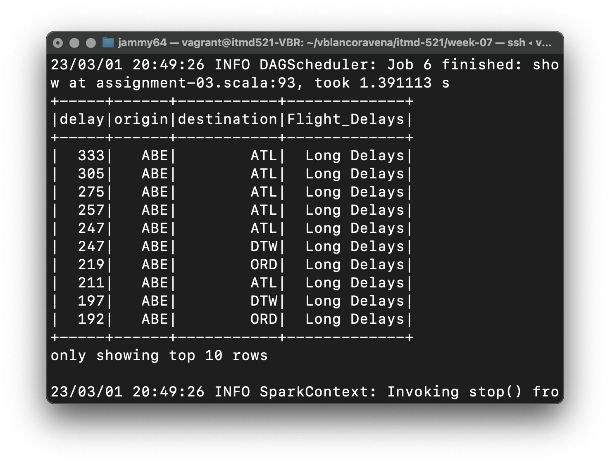
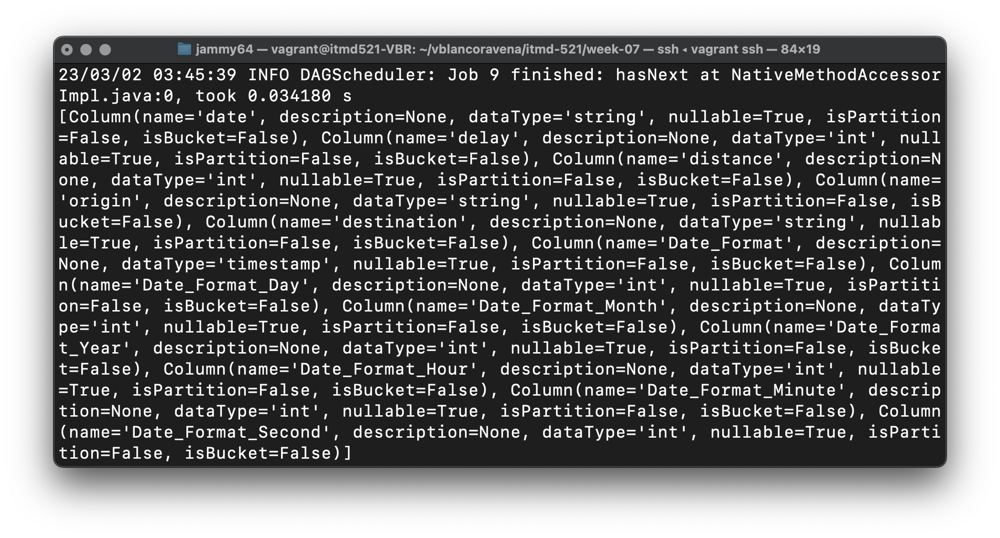
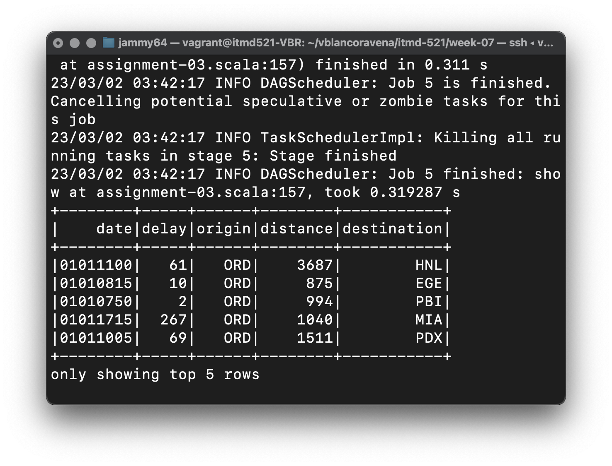
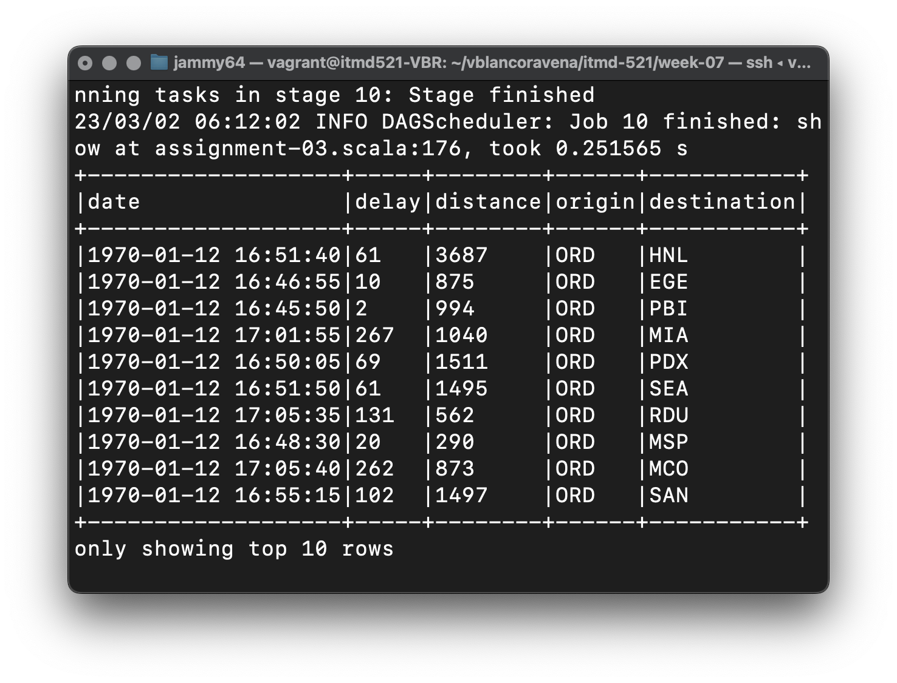

# Assignment 03

## Objectives

- Understand the structure of Spark SQL queries and how to convert them to PySpark DataFrame API calls
- Understand how to make tempViews from Tables
- Understand how to make queries against tempViews
- Understand how to use the Spark Catalog
- Examine the use of the Spark DataFrameReader and Writer to manipulate file data

## Assignment Setup

- We will be using the departuredelays files located at:
  - `~/LearningSparkV2/databricks-datasets/learning-spark-v2/flights`
  - See Python sample below for how to structure commandline input of datasources
  - Note do not use the notebook file provided, we want to challenge you to be able to build this yourself
  - All Code will be created on your local system, pushed to GitHub, and then pulled to your Vagrant Box
  - You will create one Pyspark file named: `assignment-03.py`
  - You will create on Scala file named: `assignment-03.scala`
    - And the neccesary `sbt` build infrastrucutre
  - You will continue to load data via a commandline argument passing in the path of the file

### DataFrameReader

When reading data you can use the generic `spark.read.format` command, but I recommend to use the domain specific functions.

* DataFrameReader - [parquet](https://spark.apache.org/docs/3.2.0/api/python/reference/api/pyspark.sql.DataFrameReader.parquet.html "webpage for pyspark api parquet")
* DataFrameReader - [json](https://spark.apache.org/docs/3.2.0/api/python/reference/api/pyspark.sql.DataFrameReader.json.html "webpage for pyspark api json")
* DataFrameReader - [Scala](https://spark.apache.org/docs/3.2.0/api/scala/org/apache/spark/sql/DataFrameReader.html "webpage for Spark Scala API")

## Assignment Details - Part I

Using the departuredelays.csv file, in a single file called assignment-03.py convert the remaining two Spark SQL queries from page 87 into Spark DataFrame APIs

- Type the remaining Spark SQL examples on page 87 into your code
- Run it to show the results, limit 10 records - capture screenshot of just this result
- Then type the corresponding PySpark DataFrame API below to compare answers
- The code must run and show the desired results

### Part I - Screenshot

Place required screenshot

#### Pyspark

##### Example 1 

###### Spark SQL Query

###### Spark DataFrame API

##### Example 2

###### Spark SQL Query

###### Spark DataFrame API

##### Example 3 

###### Spark SQL Query

###### Spark DataFrame API

#### Scala

##### Example 1 

###### Spark SQL Query

###### Spark DataFrame API

##### Example 2

###### Spark SQL Query

###### Spark DataFrame API

##### Example 3 

###### Spark SQL Query

###### Spark DataFrame API

## Assignment Details - Part II

- From page 90-92, you will create a Table named `us_delay_flights_tbl` from the departuredelay.csv
  - Create a `tempView` of all flights with an origin of Chicago (ORD) and a month/day combo of between 03/01 and 03/15
  - Show the first 5 records of the tempView, taking a screenshot
  - Use the Spark Catalog to list the columns of table `us_delay_flights_tbl`

### Part II - Screenshot

No data has a record with month equal to 3 (March) !!!

Place screenshot here

#### Pyspark

##### Temp View with filter values (No data has a record with month equal to 3 (March) !!!)

###### Same example but with January instead of March (being that the only change)

##### us_delay_flights_tbl listColumns

#### Scala

##### Temp View with filter values (No data has a record with month equal to 3 (March) !!!)

###### Same example but with January instead of March (being that the only change)

##### us_delay_flights_tbl listColumns

## Assignment Details - Part III

Using the file: `learning-spark-v2 > flights > departuredelays.csv`

Read the file into a dataframe, and apply the approriate schema (ie first column should be of a Date Type). Using a DataFrameWriter, write the content out:

* As a JSON 
* A JSON using Snappy Compression
* As a Parquet file

For all files use `mode` as `overwrite` so that I can run your program and your work will overwrite any previous work. Keep the filename the same, `departuredelays`.

## Assignment Details - Part IV

Using the `departuredelays` parquet file you created part III, read the content into a DataFrame, select all records that have `ORD` (Chicago O'Hare as `Origin`) and write the results to a DataFrameWriter named `orddeparturedelays`

* Use a `.show(10)` function to print out the first 10 lines, and take a screenshot
* Save as type Parquet 

### Part IV - Screenshot

Place screenshot here

#### Pyspark

#### Scala

### Deliverable

Create a sub-folder named: `week-07` under the `itmd-521` folder. Place all deliverables there.
Submit to Blackboard the URL to the folder in your GitHub repo.  I will clone your code and run it to test the functionality. I don't need the datasets as I will have them already.

Submit to Blackboard the URL to the folder in your GitHub repo.  I will clone your code and run it to test the functionality. I don't need the datasets as I will have them configured in the example-data directory -- path is important.

Due at the **Start of class** March 02nd 8:30 am
